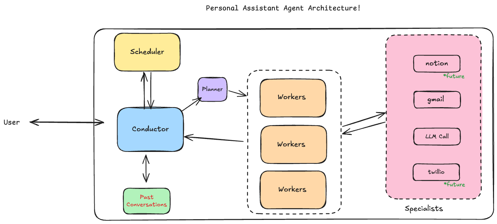

# Personal Assistant 🤖

A modern web-based personal assistant that helps you manage emails, reminders, and productivity tasks using an advanced Planner-Worker architecture with intelligent task orchestration.

## ✨ Features

- **💬 Beautiful Web Interface**: Modern, dark-themed chat interface built with Next.js and shadcn/ui
- **📧 Gmail Integration**: Check, search, compose, and manage emails with Composio integration
- **⏰ Smart Scheduling**: Natural language reminders and task scheduling
- **🧠 Advanced AI Architecture**: Planner-Worker system with intelligent task decomposition
- **📱 Real-time Updates**: Live notifications and seamless conversation flow
- **🎨 Minimal Design**: Clean, responsive UI with smooth animations and proper UX
- **🔒 Secure**: OAuth integration and secure credential management

## 🏗️ Architecture



### Core Components

- **🎯 Message Conductor**: Main orchestrator that interprets user intent and routes tasks
- **📋 Task Planner**: Breaks down complex requests into executable steps
- **⚙️ Task Worker**: Executes planned tasks using appropriate tools and integrations
- **🛠️ Tool System**: Modular tools for Gmail, scheduling, analysis, and more
- **🌐 Web Interface**: Next.js frontend with real-time updates and beautiful UX
- **💾 Supabase Backend**: Cloud database for conversations, reminders, and state management

### Task Flow
1. **User Input** → Message Conductor analyzes intent
2. **Planning Phase** → Task Planner creates execution steps
3. **Execution Phase** → Task Worker runs tools and integrations
4. **Response** → Results formatted and delivered to user

## Quick Start

### Prerequisites
- Python 3.10+
- Node.js 18+
- npm

### Setup

1. **Clone and navigate to the project**:
   ```bash
   cd personal-assistant
   ```

2. **Install Python dependencies**:
   ```bash
   pip install -r server/requirements.txt
   ```

3. **Install Node.js dependencies**:
   ```bash
   cd client
   npm install
   cd ..
   ```

4. **Configure environment**:
   ```bash
   cp .env.example .env
   # Edit .env with your API keys (see configuration section below)
   ```

5. **Start the application**:
   ```bash
   python start_web.py
   ```

6. **Open your browser**:
   - Go to http://localhost:3000
   - Start chatting with your assistant!

## Configuration

Edit the `.env` file with your API keys:

### Required
- **OPENROUTER_API_KEY**: Get from [openrouter.ai](https://openrouter.ai/) for AI models
- **SUPABASE_URL**: Your Supabase project URL
- **SUPABASE_KEY**: Your Supabase anon key

### Optional
- **COMPOSIO_API_KEY**: Get from [composio.dev](https://composio.dev/) for Gmail integration
- **COMPOSIO_GMAIL_AUTH_CONFIG_ID**: Gmail auth config ID from Composio

## 💬 Usage Examples

Once the web app is running, try these commands in the chat:

### 📧 Email Commands
- "Check my emails"
- "Show me emails from Alice"
- "Summarize today's emails"
- "Find emails about the project from this week"
- "Get my banking emails from the past few days"

### ⏰ Reminder & Scheduling Commands
- "Remind me to call mom at 6pm"
- "Set a reminder for my dentist appointment tomorrow at 2pm"
- "Schedule a task to review emails in 5 minutes"
- "List my active reminders"
- "Cancel reminder about the meeting"

### 🔧 Advanced Tasks
- "Analyze my recent banking emails and summarize the transactions"
- "Check for any important emails and draft responses"
- "Set up a weekly reminder to clean up my inbox"

## 📁 Project Structure

```
personal-assistant/
├── server/                    # FastAPI backend
│   ├── conductor/             # 🎯 Message Conductor
│   │   ├── runtime.py         # Main conductor logic
│   │   ├── tools.py           # Conductor tool definitions
│   │   └── system_prompt.md   # Conductor instructions
│   ├── planner/               # 📋 Task Planner
│   │   └── planner.py         # Task decomposition logic
│   ├── workers/               # ⚙️ Task Workers
│   │   └── task_worker.py     # Task execution engine
│   ├── tools/                 # 🛠️ Tool System
│   │   ├── gmail_tool.py      # Gmail operations
│   │   ├── scheduler_tool.py  # Scheduling tools
│   │   └── llm_tool.py        # AI analysis tools
│   ├── services/              # 🔧 Background Services
│   │   ├── gmail/             # Gmail integration
│   │   ├── triggers/          # Reminder scheduler
│   │   └── conversation/      # Memory management
│   ├── routes/                # 🌐 API Routes
│   └── models/                # 📊 Data Models
├── client/                    # Next.js frontend
│   ├── src/
│   │   ├── components/        # React components
│   │   │   ├── chat/          # Chat interface
│   │   │   └── ui/            # shadcn/ui components
│   │   ├── app/               # Next.js app router
│   │   └── lib/               # Utilities
│   └── package.json
├── .env.example               # Environment template
├── start_web.py               # 🚀 Startup script
└── README.md
```

## Development

### Backend Development
```bash
# Start backend only
python -m server.server

# Run tests
python run_tests.py
```

### Frontend Development
```bash
cd client
npm run dev
```

### Database Setup

The application uses Supabase for data storage. Required tables:
- `conversations`: Chat history
- `reminders`: Scheduled reminders

Tables are created automatically when you first run the application.

## 🚀 Key Architecture Benefits

### Compared to Traditional Chatbots
| Feature | Traditional Bots | Personal Assistant |
|---------|------------------|-------------------|
| Task Handling | Single-step responses | Multi-step task execution |
| Planning | None | Intelligent task decomposition |
| Memory | Session-based | Persistent conversation history |
| Tools | Limited integrations | Modular tool system |
| UI | Basic chat | Modern, beautiful interface |
| Scheduling | Manual | Natural language scheduling |

### Advanced Capabilities
- **🧠 Intelligent Planning**: Breaks complex tasks into optimal execution steps
- **🔄 Async Execution**: Background task processing with real-time updates
- **🎯 Context Awareness**: Maintains conversation context across sessions
- **🛠️ Extensible Tools**: Easy to add new integrations and capabilities
- **📱 Production Ready**: Built for real-world deployment and scaling

## 🔧 Extending the Assistant

### Adding New Tools
1. Create tool functions in `server/tools/`
2. Add tool schemas and registration
3. Tools are automatically available to the Worker

### Adding New Capabilities
1. **New Integrations**: Add to the tool system
2. **Custom Logic**: Extend the Planner or Worker
3. **UI Components**: Add React components to the web interface

### Customizing Behavior
- **Planner Logic**: Modify `server/planner/planner.py`
- **Worker Execution**: Customize `server/workers/task_worker.py`
- **Conductor Routing**: Update `server/conductor/system_prompt.md`

### Customizing the UI
The frontend uses shadcn/ui components. Customize:
- `client/src/components/chat/ChatInterface.tsx` for main chat UI
- `client/src/app/globals.css` for styling
- Add new components in `client/src/components/`

## Deployment

### Local Development
Use `python start_web.py` for local development.

### Production Deployment
1. **Backend**: Deploy FastAPI server to cloud platforms (Railway, Heroku, AWS)
2. **Frontend**: Deploy Next.js app to Vercel, Netlify, or similar
3. **Database**: Supabase is already cloud-hosted

## 🖼️ Screenshots

### Modern Chat Interface
The assistant features a beautiful, dark-themed interface with:
- Real-time message updates
- Typing indicators and smooth animations
- Markdown rendering for rich responses
- Gmail integration settings modal
- Timestamp display and message history

### Key Features in Action
- **Email Analysis**: Get structured summaries of your banking emails
- **Smart Scheduling**: Natural language reminder creation
- **Task Execution**: Multi-step workflows handled automatically
- **Real-time Updates**: Background tasks with live notifications

## 🎯 Demo

Try these example interactions:

```bash
You: "Check my emails from today and summarize any banking activity"
Assistant: I'll check your emails and analyze any banking activity for you.
          *[Executes: Gmail fetch → Email analysis → Summary generation]*

📧 **Banking Email Summary for Today**

• **Scotia Bank**: Authorization for $5.64 at Amazon.ca Prime
• **EQ Bank**: Interest rate changes effective September 26
• **Wise**: CAD → INR exchange rate alert (1 CAD = 64.12 INR)

All transactions appear normal. The EQ Bank rate changes may affect your savings returns.
```

```bash
You: "Remind me to call my dentist in 30 minutes"
Assistant: I'll set up that reminder for you.
          *[Executes: Time calculation → Scheduler → Confirmation]*

✅ **Reminder Set**
📝 **Task**: Call dentist
⏰ **Scheduled for**: Today at 3:47 PM
🔢 **ID**: rem_1234

You'll get a notification when it's time!
```

## 🔧 Troubleshooting

### Common Issues

1. **Module not found errors**: Install dependencies with `pip install -r server/requirements.txt`
2. **Supabase connection issues**: Check your SUPABASE_URL and SUPABASE_KEY in `.env`
3. **Frontend won't start**: Run `npm install` in the `client/` directory
4. **API errors**: Ensure backend is running on port 8001
5. **Gmail not working**: Configure COMPOSIO_API_KEY and COMPOSIO_GMAIL_AUTH_CONFIG_ID
6. **Timeout errors**: Check internet connection and API key validity

### Debug Mode
```bash
# Enable debug logging
DEBUG=true python start_web.py
```

### Logs
- **Backend logs**: Check console output when running the backend
- **Frontend logs**: Check browser console for frontend issues
- **Task execution**: Detailed logs show Planner → Worker → Tool execution flow

## 📄 License

MIT License - Feel free to use this for your own projects!

## 🤝 Contributing

This is a modern personal assistant built with cutting-edge AI architecture. Feel free to:
- Fork and customize for your needs
- Submit issues and feature requests
- Contribute improvements and new tools
- Share your own assistant implementations

**Built with ❤️ using the latest in AI agent architecture**